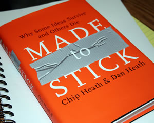

After this delightful reading of &#8220;[Made to Stick](http://www.amazon.com/gp/product/1400064287?ie=UTF8&tag=melodinmarke-20&linkCode=as2&camp=1789&creative=390957&creativeASIN=1400064287)k&#8221;, I&#8217;ve come away with a lot of great insight on how to improve my communication across ALL channels. There&#8217;s no way to summarize the main points of this book without reading it yourself. So I&#8217;ll just refer you to the authors&#8217; [official blog](http://www.madetostick.com/blog/ "Chip and Dan Heath's blog") and Cam Beck&#8217;s posts about it ([one](http://www.chaosscenario.com/main/2007/03/your_one_thing.html), [two](http://www.chaosscenario.com/main/2007/03/get_their_atten.html), [three](http://www.chaosscenario.com/main/2007/03/hit_them_with_a.html), [four](http://www.chaosscenario.com/main/2007/03/earning_the_tru.html)). But I will impart some recommendations on why this book is important.

Beginning with my enlightenment into the humanities as a teen and always having a passion for the intellectual (perhaps it&#8217;s the German in me), I&#8217;ve appreciated the abstract and Subjective. However, after being introduced to Ayn Rand and Objectivity (especially applied to leadership) in my twenties, I saw the distinct values in being direct and focused.

Well-rounded individuals will appreciate both schools of thought and apply them appropriately to various aspects of their lives. This book explains how to integrate both philosophies into our communication with others, so that our messages will strike a subliminal creative harmony that well&#8230;sticks. But most importantly, the techniques and methods Chip & Dan describe can be applied by ANYONE. Good and Poor communicators exist across all levels of our society. We all have the potential to more effectively deliver our messages in an effort to elicit the responses/actions we desire.
