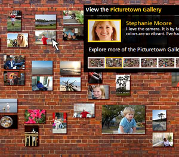

Picturetown is a microsite from Nikon, that first caught my attention from a recent commercial. I couldn&#8217;t remember the web address nor name, so I searched extensively. Finally, I called MWW on Friday and a gentleman named Kevin pointed it out to me. This post is a quick rundown of the site and my thoughts about it. Note: I am a proud owner of a Canon Rebel XT.

Picturetown opens with 2 concise sentences

Benefit: **Simple to use**

Proof: **Large sample audience (200 residents)**

Invitation to explore the story

The Homepage displays a random background photo and centered in the screen is a navigation menu with 4 primary site sections, divided by expandable panes.

#### The Story

Well executed video about the program

#### The People

7 stories of people&#8217;s lives and their experiences with the camera. Includes video, some photos taken, comments, send-to-a-friend, and photo download option.

The Picturetown Gallery
7 brick walls (pages) with various participants photos.

#### The Nikon D40

7 main features each linked to one of the 7 people&#8217;s stories (very cool)

In all, it&#8217;s one of the best microsites I&#8217;ve ever seen. I enjoyed the stories and the social features of emailing and commenting on photos. My only concern is the visibility of this unique campaign. Without the name Picturetown and its address, it was difficult for me to find using Google and navigating Nikon USA&#8217;s website. There should at least be some reference to Picturetown on Nikon Digital&#8217;s official D40 page. How about better visibility with either standard or sponsored results on a [Google search on Nikon D40](http://www.google.com/search?hl=en&q=nikon+d40).

What do you think?
