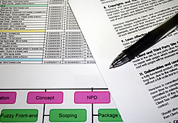

Continuing on the subject of new product development, today I&#8217;ll discuss **&#8220;Building the Business Case & Plan&#8221;**.

This follows the Concept Review and the previous phase: [&#8220;Scoping&#8221;](../scoping/). This is the last phase of Concept Development.

A new product is a venture. It may represent the initial reason for a company&#8217;s existence, or it may be part of its plans to grow. Whether we&#8217;re building a breakthrough, platform, or incremental product&#8230;developers and companies still need to perform a solid analysis before they start developing. This phase is difficult, complex, and resource-intensive. I will admit that some scenarios will not warrant expending much time in this phase. After all, being flexible and highly responsive to the needs of the market and customers should be commended. However, the amount of effort a firm places into this phase, at least into the breadth of its activities, is directly relational to the success of the product. Both commercially and in terms of development time.

#### This phase is made up of 4 steps:

  1. Product Definition and Analysis
  2. Building the Business Case
  3. Building the Project Plan
  4. Feasibility Review

### Product Definition and Analysis

The first step is composed of a series of activities that will give you the inputs to effectively define your product and justify your reasoning to develop and commercialize it. Some activities are run concurrently to others. I&#8217;ll try to explain it as follows:

#### User Needs & Wants Study

Here we try to understand what creates value for the customer. What benefits does the product give? What features and attributes should it have? You should try and conduct interviews and surveys with existing and potential customers, in addition to sales channel partners. Don&#8217;t forget your staff&#8217;s opinion.

#### Market Analysis

How large is the market and how is it segmented? What is its rate of growth? What trends are affecting the competitive offerings and buyer behavior? Who are the buyers and through what channels can they be reached?

#### Competitive Analysis

Knowing how your competitors operate and their relative strengths and weaknesses is key to not only building a great product, but also in how and where you will launch it.

The results of the preceding activities will help build your product definition and provide the foundation for your marketing strategy. Next, we&#8217;ll have to do three things:

#### Build a Technically Feasible Product Concept

This includes the substance (materials, form, packaging) and the various methods and activities needed to produce the product.

#### Production & Operations Costs Analysis

#### Marketing and Expected Launch Costs Analysis

Next we&#8217;ll want to:

#### Test the Concept

Develop drawings, models and early prototypes which you can gauge reactions to through presentations to your staff, existing and potential customers, and channel partners. This should give you feedback on what changes may need to be made, in addition to an idea of what sales potential the product may have, which you&#8217;ll need for your financial analysis.

#### Build a Solid Product Definition

Based on the cumulative activities performed and additional feedback received.

Lastly we&#8217;ll perform three analyses based on the information gathered so far:

#### Business Analysis

Here we undertake a full examination of why this product makes business sense. We&#8217;ll want to look at the competitive and strategic rationale, the competencies of the firm, and determine the capabilities and roles of partners and suppliers. Letters of intent will be required from any 3rd parties.

#### Risk Analysis

What are the variables that will affect the development and commercial success of this project? How might they be mitigated? Which will seriously affect the viability of this product venture?

#### Financial Analysis

This involves taking combining data from your market and operational analyses to determine what kind of return on investment is possible. Methods include Net Present Value (NPV), Internal Rate of Return (IRR), Payback Period, Expected Commercial Value (ECV), Earnings before interest and taxes (EBIT), and Shareholder Value Added (SVA).

These are the activities that make up the first step. Information gathered in the Discovery and Scoping phases are used as a foundation for further exploration here. Even if your product is just a line extension or an incremental change, it&#8217;s advised that you participate in as many activities that are reasonable for your unique strategy and business reasoning for developing the product.

### Building the Business Case

The Business Case is a living document that defines the product and provides the rationale for developing it. It will be referred to throughout the development process and channel readiness phase, and will be revised as necessary. Although the exact format of this document will vary by company, these are its primary components:

  * Results of the activities of Product Definition and Analysis
  * Legal and regulatory requirements
  * Safety, health, and environmental considerations
  * Assumptions made to draw the conclusions you have, and why you believe they are valid and reasonable.
  * Out-of-bounds criteria that indicate certain changes/events which will mandate an emergency business case review

### Building the Project Plan

This includes:

  * A scheduled list of events, tasks, and actions for the development phase. Timelines are included in the form of Gantt charts or critical-path plans.
  * The human, time, and financial resources that will be required for the development phase.
  * Defined and measurable milestones to be completed within the development phase.
  * Tentative action and resource plans for the marketing, sales, production, and related channel readiness activities.
  * An expected product launch date

### Feasibility Review

This is the final review session where management, marketing, and technical staff meet to discuss and review the rationale for pursuing the project, the risks involved, a financial analysis, the resources required, and the project plan. If everything looks good, give yourself a round of applause! Now go ahead and proceed to __Product Development__.

For more information on the various phases in NPD, visit the master page on [The Stage-Gate Model of New Product Development](../the-stage-gate-model-of-product-development/ "stage gate model of new product development by robert g. cooper")

&#8212;&#8212;&#8212;&#8212;&#8212;&#8212;&#8212;&#8212;-

I would absolutely love any feedback on this phase or any elements thereof. Please share any thoughts you may have!
