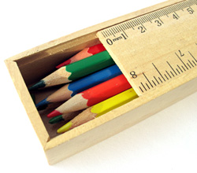

Mario: To build some greater perspectives on product design in the modern age, I&#8217;ve invited DT of [Design Sojourn](http://www.designsojourn.com/ "Design Sojourn website") to a little chat about the subject. DT helps build objectives, strategies and development plans for consumer electronics firms across Asia. He&#8217;s been a pioneer in promoting the field of  [Industrial Design](http://en.wikipedia.org/wiki/Industrial_design "Wikipedia article on industrial design"), in many more regards than simply admiring fanciful oeuvres d&#8217;art et leurs aspects fonctionnels (French for art and functional objects). He reaches out to students and other professionals alike in sharing theory, trends, and best practices in the workplace and beyond, while celebrating the contributions of others to the field.

DT, thanks for stopping by and leaving some feedback on my post [New Product Design Strategy](../new-product-design-strategy/). I feel that I&#8217;ve barely scratched the surface on this field, as most of what I&#8217;ve come to learn has been from my own experiences with CPG manufacturers, some friends, and my <a rel="nofollow" href="http://www.pdma.org/">PDMA</a> [Handbook](http://www.amazon.com/PDMA-Handbook-Product-Development-Second/dp/0471485241/ref=pd_bbs_sr_1/105-6197686-6153269?ie=UTF8&s=books&qid=1190140602&sr=8-1 "PDMA handbook of product development on Amazon"). What other kinds of strategies or considerations should marketers and product developers be making these days?

DT: Thanks for the wonderful introduction. I have to say you have nailed it at first go. With regards to your list of strategies, they are pretty much all there. But from my point of view I would consider them as tactical implementations instead.

These days marketing and product development and perhaps corporate people have to understand that Strategic product development takes a 360 degree holistic view and outlook. Also to me strategic product development is multi-disciplinary and success means satisfying all requirements of stake holders.

Under the current environments stories such as where marketing communications come up with great ad campaigns, but some how the products fall short on the brand promise, or Research and Development creates an amazing technology, but some how sales don&#8217;t seem to understand it, are very common.

Strategic product development prevents this. In many ways Industrial Designers are uniquely positioned to bridge this gap, as they have a multi-disciplinary approach to problem solving that is based on a strong background in research drawing inspiration from many sources.

Mario: Interesting. It appears to me that the situation you&#8217;re pointing out is that there&#8217;s a disconnect between product development and the marketing function, arising in the form of communication. In theory, a firm is supposed to carry and update the product definition from its beginnings in concept development, through the product development phase, and into the launch phase where it is then slightly tuned for the target markets. Traditionally, the responsibility for this communication lays in the hands of project leaders, core product development leaders, and launch leaders.

But what happens leadership is weak or non-existent? This seems to be a common risk these days, with global distributed product development and outsourcing being as common as it is. What I believe you&#8217;re hinting at, is that communication is an inherent part of all design strategy. Not just for project management purposes, but for the eventual market success of the product as well. This means that marketing and product development have a responsibility to collaboratively spell out the product&#8217;s features, attributes, benefits, value proposition, and positioning. I think it&#8217;s irresponsible to expect marketing (especially outsourced agencies), to make all this up on their own.

Do you see the current climate of outsourced product development necessitating even stronger communication bridges with marketing and stakeholders? What do you think?

DT: It not so much about just fixing a disconnect or making communication better, its actually more about a strategic management of the product development process.

You could say that project management manages and forms a node point between say R&D and marketing thus facilitating good communication. In fact that is still a major requirement in making successful products. However in my view this is still a line function. Project managers are often so caught up in the daily grind such as, tracking schedules, negotiating contracts, ensuring deliverables, that I often find that they don&#8217;t have a chance to ask if all this madness is right in the first place.

Therefore as a result of this designers recently have been finding a niche, especially in large organisations. Their strategy visualisation skills are vital in ensuring if the organisation is traveling in the right direction in the first place. Furthermore the designers ability to move between disciplines or departments and empathising with them, means this new thought in strategic product development assumes that the designer is not a function of any other department (ie R&D or Marketing) but a function of management. As a result if you notice many successful companies today, such as Apple, P&G or IBM, have very senior design managers working closely with the CEO or the board of directors.

Not only that, if we zoom out from our discussion here, this is really all about innovation and getting ahead right? So if a designer&#8217;s strategy visualization has to have any weight, it must come as a directive from the top. It is, ironically, pretty regimental if you look at it, but innovative thought, solutions and strategy puts people out of their comfort zone and if the &#8220;order&#8221; does not come from the top, personal motivations tend to get into the way of the best interests of a company.

This also leads me to you next point, outsourcing. It is inevitable, companies need to out source to stay alive. But the down side means development gets more fragmented and as a result the strategy stake holder is absolutely vital in ensuring that the end product meets all the expectations set out.

Mario: I like your description of design leadership transcending the traditional organizational departments and becoming a part of upper management, should a company allow such integration. Although it might seem idealistic to imagine industrial designers reaching across different parts of the company to develop creative solutions where there are problems, I believe their greatest contribution to the firm lies with developing the company&#8217;s product innovation strategy and managing the product portfolio. This is an elevated position that will span disciplines in marketing, finance, r&d, and supply chain management, for which specialized masters education programs will be necessary.

Regarding outsourced product development, I see and share your concern. Traditionally, almost every part of a business can be outsourced these days. But in modern business today, when marketing and innovation are outsourced, there lies a very large potential risk of losing company identity, a spiritual sense of ownership, direction, and control. Companies that maintain a long-term vision must keep this in mind, and thus exercise due care when working with third parties. As external activities become more important to the firm as critical competencies, the level of partner relationships must deepen and in-house talent has to be developed as appropriate to the circumstances. All I&#8217;m advocating is that to be true to yourself as a company, you are responsible for your own vision and direction. Partners can help you build upon that.

Before I begin my next question, what are your thoughts on this?

DT: I actually disagree with you to a certain extent, but you are correct to say that the characteristics of such very senior designers require many years of training and exposure to many parts of the organization. A good MBA helps as well. Thus such designers with such abilities are rare indeed.

You are also correct to say that designers have the greatest contribution to innovation strategy and product portfolio, but that is what we traditionally think are the roles of designers. Don&#8217;t misunderstand me, I am not saying designers should take over or lead the functions of marketing or R&D etc., instead far from that. If you would like, the role of strategic designers are in a form of facilitators that make recommendations based on the empathy of the requirements of the rest of the team. Strategic designers work with the departments to find solutions in perhaps a role of a in-house consultant. Another way is to look at them are as &#8220;cooks&#8221;.

With regard to outsourcing, as you mentioned you can outsource everything including your own life. But these days companies are starting to get smart with this and realize you cant out source everything. So its only on one level that we need to talk about strong partnerships, but the smart companies are identifying their strategic competitive advantage and are choosing to keep it in house rather than out sourcing. Take for example HP they don&#8217;t outsource their printer component design.
