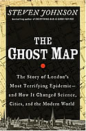

Sometimes a true story comes along that is suspenseful and gripping. Not for the facts, but for the manner in which the author has laid out the narrative combining the historical background, situation, characters, and long-term implications.

While business, sociology, and design books have been the staple of my reading diet over the last year, it was a historical nonfiction book that captured my attention last weekend: [The Ghost Map by Steven Johnson](http://www.amazon.com/gp/product/1594482691?ie=UTF8&tag=melodinmarke-20&linkCode=as2&camp=1789&creative=390957&creativeASIN=1594482691).

While the story is about 2 gentlemen whose efforts helped cease a Cholera outbreak in a London district in 1854 and subsequently advanced the nascent field of [epidemiology](http://en.wikipedia.org/wiki/Epidemiology "epidemiology article on wikipedia"), there is an important underlying lesson. Theories are vastly abundant and can be made by anyone. Evidence or proof is often demonstrated by the presence of correlating phenomena. But correlation does not prove causation. Thus in the lack of strong evidence that is supported by multivariate data sources, we must be a bit careful in what we hear/read/see and choose to establish an opinion or belief about.

Skepticism can be a virtue. It can prevent you from following the wrong path, leading down many popular, yet false and dead-ending roads&#8230;which in the end may just leave you holding a [confirmation bias](http://en.wikipedia.org/wiki/Confirmation_bias "Wikipedia on confirmation bias"), a shield for the ego.

In this day and age, we marketers must be wary of fads and marketplace happenstance, versus viable long-term trends. We know that technology and a culture of participation have been radically transforming certain aspects of our lives. See my post on [Wikinomics](../book-review-wikinomics/ "Wikinomics book review") for a glimpse.

My point is that in this day of hyperactivity and innovation, let us not forget to gather facts from multiple angles; let us not limit our field of view in popular paradigms and models as absolute platforms for the future; let us remember that substantial change is only possible when its total perceived cost is much lower than the total perceived benefit.

Be skeptical &#8211; Build a case &#8211; [Communicate](http://www.conversationagent.com/ "Valeria Maltoni is the Conversation Agent") it well
