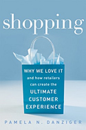

Pam is one devoted marketer; passionate about the art of retailing and understanding the consumer.

[Shopping gives pleasure](http://www.amazon.com/gp/product/1419536362?ie=UTF8&tag=melodinmarke-20&linkCode=as2&camp=1789&creative=390957&creativeASIN=1419536362). We live now in an age of abundance, affordability, and availability of product categories across various types of retail establishments. While price and a wide selection of merchandise are important to shoppers, the total shopping experience influences people to buy, makes people want to enthusiastically return, and tell their friends.

A shopper&#8217;s **Propensity to Buy = (Needs + Features + Affordability) x Emotion^2**

### Needs

Are true necessities within one&#8217;s cultural framework (real or perceived). Then, there are Wants and Desires (satisfied or aspired). What then becomes &#8216;necessary&#8217; is really variable given one&#8217;s financial status, value system, and place/stage in life.

_Justifiers_ though, turn desires into Needs, and give shoppers the reason, rationale, excuses, and thus permission & motivation to buy. The following are some common justifiers:

  1. **Special Occasion** &#8211; Perhaps related to a holiday, season, trip, wedding, religious, or cultural event.
  2. **Beautify the Self or Home** &#8211; Gives an emotional boost.
  3. __Pleasure__ &#8211; Derived from having, owning, using, and perhaps even purchasing.
  4. **Education** &#8211; Becoming better educated, learned, and gaining new understanding and skills.
  5. **Relaxation & Stress Relief** &#8211; Finding solace & gaining inner peace/harmony are the preferred motivators for buying experiential goods.
  6. **Entertainment** &#8211; To stimulate the mind & imagination, relieve boredom, and a way to bring people together to share fun and good times.
  7. **Replacement** &#8211; Practical reasoning. This motivator can be powerful because it allows people to consider purchasing a model that may be more upscale, green, affordable, updated, or another attribute.
  8. **Emotional Satisfaction** &#8211; From the browsing and shopping experience itself, regardless what, if anything, is purchased.
  9. **Enriching One&#8217;s Life** &#8211; The strongest motivator of all; related to Maslow&#8217;s self-actualization stage and the sensation of progression through life&#8217;s stages and their perceptual aspects based on one&#8217;s values & aspirations. These include:

    * __Intellectual__ (education, understanding)

    * **Physical** (robust health, stamina, comfort, pain- and disease-free)

    * **Spiritual** (sense of purpose, way to understand the unknown, meta-physical connection to others)

    * **Emotion** (love, happiness, freedom from fear & worry)

    * **Social** (sense of connectedness to others, friendship, belonging, participation)

### Features

Product functionality and performance are taken for granted nowadays. Features though, most often represent the extra bonuses conferred and thus are important insofar as they play off our emotions. Shoppers are really evaluating the promises of how an item will perform emotionally & experientially for them.

### Affordability

A major hot button of course. There&#8217;s an absolute level, which gives us clear boundaries based on our current disposable income. Then there&#8217;s a relative level, that makes us consider sustainability & replacement cost, the price of complementary goods & services, and simply what&#8217;s within our budget if we have other items still on our shopping list.

### Emotion

First Power: Combined with justifiers, they will magnify a Need; positive association will make Features attractive; and our emotional reaction to a price will make a desired item more, or less, affordable.

Squared: Retailers&#8217; design of the total shopping experience creates the mood to buy, tell-a-friend, and become loyal customers.

### How Retailers can make stores that &#8220;Pop&#8221;

  1. **Involvement** &#8211; Encourage and promote high-levels of interaction that induce people to touch, feel, taste, try-on and participate.
  2. **Curiosity** &#8211; Evoke shopper&#8217;s curiosity to explore and experience through the design of shop windows, store layout, the entrance, and story-based displays.
  3. **Contagious** &#8211; The store has to have some undercurrent of electric quality, exuding energy & excitement.
  4. **Convergence** between atmosphere, store design, and merchandise that is consistent and reflects a comprehensive vision that captures all the tangible and intangible elements.
  5. **Authenticity** in the store concept and the way it&#8217;s driven, exhibiting the founder&#8217;s values and not just being a place where merchandise is sold.
  6. **Price/Value** &#8211; Offer shoppers a superior value at a reasonable cost; try to enhance/support value rather than simply apply markdowns.
  7. **Accessibility** &#8211; The store has to be inviting to most anyone; there should be no pretensions of exclusivity, being snobby, or catering only to a certain class of people.

#### Additional Recommendations (from the book, personal opinion, and other sources):

  1. Hire the right kind of employees appropriate to your culture and their position; pay them a reasonable wage; naturally, encourage friendliness and personability; ensure they&#8217;re knowledgeable about the products; and be like Nordstrom and have them &#8216;Follow their best judgement&#8217;.
  2. Establish fair return/exchange policies; encourage special ordering.
  3. Maintain a clean store and bathrooms.
  4. Be cutting-edge and continually try something new in your merchandise assortment, hold special events and promotions, and find new ways to interact with your customers. Innovate with surprise.
  5. Pursue private-label programs to offer unique merchandise. It&#8217;s becoming ever more feasible and affordable even to small retailers, and it&#8217;s proving to be a good branding strategy that can be quite profitable too.

&#8212;&#8212;&#8212;&#8212;&#8212;&#8212;&#8212;->>>>>>

I found the book interesting, though subjective at times. What really flows is the Pamela&#8217;s passion and the way she describes the retailers across the country including unique boutiques, Anthropologie, and Barnes & Noble among others. For more information, here&#8217;s the book&#8217;s [Amazon page](http://www.amazon.com/gp/product/1419536362?ie=UTF8&tag=melodinmarke-20&linkCode=as2&camp=1789&creative=390957&creativeASIN=1419536362)
