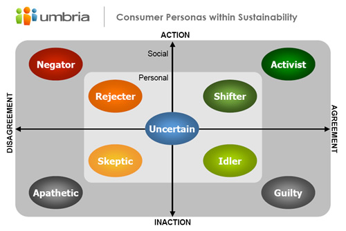

### Speakers

Janet Eden-Harris, CEO, Umbria

Averill Doering, Manager of Consumer Insights & Strategy, Umbria

### Summary

<a href="http://www.umbrialistens.com/">Umbria</a> is a marketing intelligence company that analyzes social media —including blogs, message boards, Usenet, and product review sites. They deliver not just data, but insights into brands, markets, consumers and trends.

In this presentation, Janet and Averill discuss some basic findings from a recently completed, much larger study based on analysis from millions of blogosphere conversations. Topics included:

1 ) Who Umbria is and their research methodology. According to a five-spoke diagram around a Topic, they identify:

* **Who** (Age, Gender)
* **What** (Sentiment, Subtopics, Unmet Needs)
* **How Much** (Posting Volume, Speaker Volume)
* **When** (Posting Date)
* **Why** (Values, Purchase & Usage, Media)

2 ) The level of discussion online, popularity of topics, relation to brands, and how these numbers have shifted between 2007-2008. The current top five most talked about industries are: Energy & Fuel, Automotive, Food & Beverage, Transportation & Travel, and Packaging.

3 ) Who&#8217;s talking?

* 45% Gen-Y (33% Female, 12% Male)
* 26% Gen-X (17% Female, 9% Male)
* 29% Boomer (13% Female, 16% Male)

4 ) Umbria identified 9 consumer profiles around sustainability; placed them on a grid with the x-axis measuring disagreement to agreement, and y-axis measuring inaction to action; and their percentage changes between 2007-2008. They include: Apathetic, Negator, Skeptic, Rejector, Uncertain, Idler, Shifter, Guilty, and Activist.

Between 2007-2008, the percentage of Negators and Uncertains decreased, while Shifters, Idlers, and Guilties increased. Profiles are further explained in the slide presentation (see Additional Learning).

5 ) The challenges facing consumers in regards to awareness, understanding the &#8216;truth&#8217; and source credibility, are large. Inputs include: Journalists, Enthusiasts, Friends & Family, Experts, Government, NGO&#8217;s, Academics, Artists, and Businesses. Staying aware is important, but folks have a limited temporary interest capacity before they&#8217;re willing to listen again. Green & Eco-fatigue is very real &#8211; too much info can lead to apathy, cynicism, uncertainty, and guilt.

6 ) Next on the path come feelings of accountability (am I responsible? can I make a difference?), and personal relevance (is this meta/sub-topic even important or relevant to me, my lifestyle, and interests?).

7 ) Regarding Action, individuals will consider:

  * **Lifestyle Impact & Habit**
  * **Availability**
  * **Cost** (Financial, Time, Other)
  * **Quality** (comparing alternatives)
  * **Functionality**
  * **Usage Experience**

8 ) How consumers are perceiving benefits today? Largely, they tend to be:

  * **Intangible** (relatedness hard to grasp)
  * **Difficult to Measure** (subjective; no easy green metrics available on &#8216;green&#8217; we are now, versus where we could be)
  * **Uncertain** (How do my actions impact the community, the greater cause at hand, and the future (immediate, long-term)

9 ) What benefits do they desire though? They are:

  * **Seamlessness**
  * **Productivity**
  * **Social Connection**
  * **Inspiration**

10 ) What are people&#8217;s desired emotions?

  * **Accomplishment** (Personal)
  * **Pride & Acceptance** (Social)
  * **Stress & Anxiety Reduction**
  * **Excitement**

11 ) A Three-Step Framework for making brands resonate and inspire action:

  * Realism: Make it **Simple**
  * Relevance: Make it **Personal**
  * Social: Make it **Visible**

12 ) At large, successful organizations will need to answer the following questions:

  * **Why** &#8211; this need, benefit, desire
  * **What** &#8211; offering will fulfill these
  * **How** &#8211; should this be delivered

###  **Additional Learning**

  * Umbria Environmental Sustainability Report
  * The Blogosphere: Greenfield or Minefield? &#8211; Janet and Averil host a webinar with slides, from a similar presentation in Jan. 2008.
  * Visit <a href="http://www.umbrialistens.com">Umbria.com</a> for additional case studies, webinars, and insights.
  * The slides and audio from this presentation can be found at the Sustainable Brands 08 conference website. Simply register at: http://www.sustainablebrands08.com/user/register , then click on Presentations, select June 4th, then look for 3:10-3:55pm.
