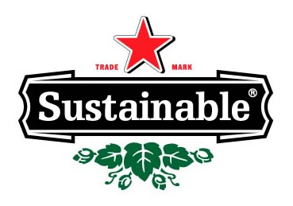

Lewis Green asked the following question to his readers in this post:

**Sustainability is Hot! Are you? What does it mean to have a Sustainable Brand and/or be a green company? Do today&#8217;s businesses, some of whom are rushing to be labeled green, get it? Is authenticity key or can a company use marketing to get consumers to see they are green?**

With some great responses you can read from his post, here is mine:

It means to be both environmentally conscious and be economically minded, through extreme efficiency and a goal of zero waste in operations, manufacturing, marketing, and product development. Setting goals and auditing to meet performance metrics will determine progress.

Authenticity and transparency are important. The degree to which you want to promote it though, will be up to the organization and the circumstances. In many cases, companies are already being responsible in their supply chain or other areas. The point is then to responsibly create an awareness program that at least states the facts, as part of a public relations package on corporate social responsibility. For other firms that are seizing the market opportunity on sustainability, obviously their communications are much stronger on the green/clean message. But their responsibility toward ethical communications remain the same.

But when the product is supposed to be green/sustainable, one must naturally be careful and not claim superfluous attributes that are vague. Perhaps the deep truth is real. In that case, marketing copy, language and graphic design has to be carefully constructed so as not to be critically/vaguely perceived. Third party audits and certifications are helpful, but only to the degree that the third party is recognized and credible. There is literally a fight going on among organizations that want to claim their label as being the best. Much of it is ego-driven, but most of it is about money. The labels with the most recognition and adoption by reputable companies will win. However, the government is the largest purchaser of most goods. It&#8217;s their actions to really watch under the radar, because although they&#8217;re slow as dinosaurs, they have a responsibility to the public to be very fair and objective. I&#8217;m still talking about product-orientation, everything else is CSR related and another world of its own.

Much of this reminds me of health food marketing. But claims like &#8220;99% fat free&#8221; (by weight doh!), won&#8217;t work in the green space because misleading claims are going to be found out about, blogged on, and criticized by others (and the competition).

. . .

**What do YOU think?**
