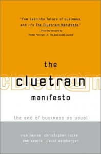

Following some years in the social media space, I have read many great books on the subject of _&#8220;the end of business as usual&#8221;_, online communications, marketing, sociology, and have learned quite a great deal. But one book kept on popping up here and there as the so-called &#8220;Bible&#8221; of this movement: [The Cluetrain Manifesto](http://www.amazon.com/gp/product/0738204315?ie=UTF8&tag=melodinmarke-20&linkCode=as2&camp=1789&creative=390957&creativeASIN=0738204315)

Sitting on my shelf now for over 6 months, I finally picked it up a few weeks ago and must say that I haven&#8217;t been so thoroughly entertained by a sociology/business book in a LONG time. The entire 95 theses and the rest of the chapters <a rel="nofollow" href="http://www.cluetrain.com/">can be found online</a> as well, in case you&#8217;re interested.

So the Cluetrain is already 10 years old at this point, and reminds me in many ways of the coming impact Natural Capitalism and The Ecology of Commerce would have on the sustainability movement. Big changes were afoot and still are. A better future was possible and happening right now &#8211; Markets are Conversations

While the term Conversations has been used and thrown so often with sometimes vague and happy connotations, and other times with a deep analysis of the underlying societal changes underway, the verb Converse and its nominalized form Conversation, do best summarize the impact of the networked world&#8217;s effect on interpersonal communications.

Interpersonal. The brand, the company, the nonprofit &#8212; all are mental constructs for what we&#8217;d like to associate with a personality or bag of experiences. Yet, we know they&#8217;re made of people, and in the words of Dale Carnegie and countless others including Jeffrey Gitomer, people like to interact with other people. One can be a fan of a brand/org, but to get the best interaction &#8211; one needs to connect with another person. Hence the just claim by my pal [Alan Wolk](http://tangerinetoad.blogspot.com/) that, [&#8220;Your brand is not my friend&#8221;](http://tangerinetoad.blogspot.com/2007/06/your-brand-is-not-my-friend-web-20.html). So if you&#8217;re an org of any sort, don&#8217;t approach us  and attempt to entice favorable appeal by employing semi-conversational language just so you can increase your friend/follower numbers. That&#8217;s just another version of advertising. Use the human voice in your communications, sure. But if we&#8217;re going to have some kind of relationship, we&#8217;re going to come to you on our own accord.

Is there much more to say other than Be Approachable and Be Personal? Not really, except in Locke and Weinberger&#8217;s own 12-step program for internet business success: Relax, Have a sense of humor, Find your voice and use it, Tell the truth, Don&#8217;t panic, Enjoy yourself, Be brave, Be curious, Play more, Dream always, Listen up, and Rap on.

**Additional Resources:**

  * <a rel="nofollow" href="http://www.amazon.com/Citizen-Marketers-When-People-Message/dp/1419596063/ref=sr_1_1?ie=UTF8&s=books&qid=1237148990&sr=1-1">Citizen Marketers</a> and <a rel="nofollow" href="http://www.amazon.com/Creating-Customer-Evangelists-Customers-Volunteer/dp/1419597213/ref=pd_sim_b_3">Creating Customer Evangelists</a>, by [Ben McConnell and Jackie Huba](http://www.churchofthecustomer.com/)
  * <a rel="nofollow" href="http://www.amazon.com/Personality-Not-Included-Companies-Authenticity/dp/0071545212/ref=sr_1_1?ie=UTF8&s=books&qid=1237148892&sr=1-1">Personality Not Included</a>, by [Rohit Bhargava](http://rohitbhargava.typepad.com/)
  * <a rel="nofollow" href="http://www.amazon.com/Groundswell-Winning-Transformed-Social-Technologies/dp/1422125009/ref=pd_bbs_3?ie=UTF8&s=books&qid=1237148790&sr=8-3">Groundswell</a>, by Charlene Li and Josh Bernoff
  * <a rel="nofollow" href="http://www.amazon.com/Secrets-Social-Media-Marketing-Conversations/dp/1884956858/ref=pd_bbs_sr_1?ie=UTF8&s=books&qid=1237148790&sr=8-1">Secrets of Social Media Marketing</a>, by <a rel="nofollow" href="http://paulgillin.com/">Paul Gillin</a>
  * [Valeria Maltoni](http://www.conversationagent.com) (see also her discussion of the Cluetrain)
  * <a rel="nofollow" href="http://www.amazon.com/Seth-Godin/e/B000AP9EH0">Seth Godin</a>
  * <a rel="nofollow" href="http://www.amazon.com/Word-Mouth-Marketing-Companies-Talking/dp/1427798613/ref=pd_bxgy_b_img_b">Word of Mouth Marketing</a>, by <a rel="nofollow" href="http://www.damniwish.com/">Andy Sernovitz</a>
