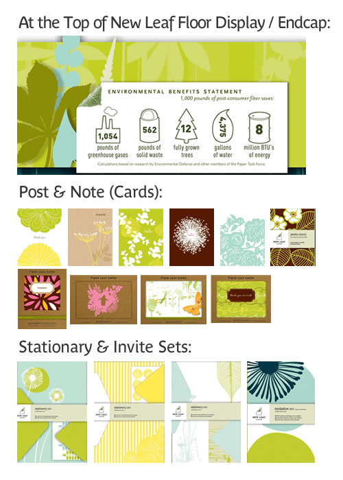

<a rel="nofollow" href="http://www.businesswire.com/portal/site/google?ndmViewId=news_view&newsId=20090416005043&newsLang=en">Office Depot Turns a Brighter Shade of Green; Expands Retail Partnership with Environmental Sustainability Pioneer</a>

So famous paper products manufacturer <a rel="nofollow" href="http://www.newleafpaper.com/">New Leaf Paper</a> recently announced they&#8217;ll be exclusively selling either a floor display or endcap in 1,000+ Office Depot stores with 60 stationary, resume paper and envelope products. <a rel="nofollow" href="http://www.businesswire.com/multimedia/google/20090416005043/en/1784471">Click here for the full display photo</a>, or check out my montage below.

What I particularly like are the items&#8217; elegant style and the clear multi-resource savings indicator from using post consumer fiber at the top of the display. Simply telling people that a product is on environmentally friendly paper, or proudly showcasing a [FSC certification](http://www.fsc.org/pc.html) mark just doesn&#8217;t cut it folks. People look for one thing in a card: The design. The more prominent we can place that additional info on why this paper product is comparatively better than other brands, without disturbing the visual stimulation and enticement factors at play, the better.

**Quick Note:** New Leaf&#8217;s President, <a rel="nofollow" href="http://www.sustainablelifemedia.com/events/SB09/speakers/bios#jmendelsohn">Jeff Mendelsohn</a> will be speaking at <a rel="nofollow" href="http://www.sustainablelifemedia.com/events/sb09/schedule">Sustainable Brands 09</a> in the session: **A Brief History & Some Quick Takes on the Future of the American Corporation**, along with <a rel="nofollow" href="http://www.sustainablelifemedia.com/events/SB09/speakers/bios#smaccormac">Susan MacCormac</a>, _Morrison Foerster;_ and <a rel="nofollow" href="http://www.sustainablelifemedia.com/events/SB09/speakers/bios#jgilbert">Jay Coen Gilbert</a>, _B Corp._
