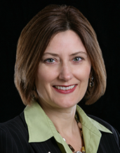

*Interview with:*

Susan Burns, [Global Footprint Network](http://globalfootprintnetwork.com/)

_June 2009_

**Hi Susan, could you tell us about the Global Footprint Network and its mission?**

Our vision is that all people live well, within the means of nature. Please see these links from our website about <a href="http://footprintnetwork.org/en/index.php/GFN/page/at_a_glance" target="new">our mission </a>and our programs.

**Looking over your upcoming workshop on June 4th, I see you&#8217;ll be highlighting future business scenarios in a resource-constrained world (water, energy, food, other), and helping folks understand these trends while appropriately positioning themselves for success. I know water use & efficiency is already a huge issue. An interesting case I read about recently is cocoa beans, and that the world&#8217;s largest confectioneries are already preparing themselves. Is there a resource you&#8217;re particularly passionate about and would like to share with us?**

Yes, it’s true about resource scarcity &#8211; there is a resource scramble going on right now. Not only are private companies (like Nestlé) securing land to ensure their supplies, but countries like China and United Arab Emirates are purchasing land, especially in Africa, to secure food for their people. So, there isn’t one resource that I am particularly concerned about, I’m concerned about all of them, which is why I’m fond of the Ecological Footprint framework. We are exceeding the planet’s limits in all renewable resource types and it is helpful to think about this from a system’s perspective. When you look at the larger trends, very simple ones like population and consumption, you will see that we are in “Ecological Overshoot.” Overshoot is when we use more of nature than nature can regenerate. If you address one trend at a time, you end up shifting burden from one issue to another. A notorious case is what we’ve been doing with biofuels &#8211; putting additional pressure on crop and forest land in order to address the climate crisis. Ultimately, overshoot needs to be address as a whole, even while people are working on the individual issues.

**Note to readers: See the 11min presentation video by Susan below for a great introduction to the topic**

[Video Link for Email/Other Subscribers &#8211; 11min](http://vimeo.com/11123761)

**Your bio notes that you&#8217;re an expert in the application of the Natural Step framework. In essence, its goal is the restoration of living systems by expanding life-sustaining resources and managing societal demand for natural/other resources.**

Source: <a href="http://www.flickr.com/photos/rosenfeldmedia/3261675030/in/set-72157613412642793">Figure 3.18 from &#8220;Design is the Problem&#8221;, by Nathan Shedroff and Rosenfeld Media</a>

**Specific tools and techniques for systemic evaluation & program development are created individually by organizations and specialty consultancies.**

**Tell us about your passion for the Natural Step framework and perhaps share a story if you can.**

I guess I have a love for systems thinking and looking upstream for answers. That’s why for the last 20 years I have dedicated most of my energies to bringing the Natural Step framework and the Ecological Footprint to corporations and governments. I have seen over and over again, that when we bring a holistic framework to people, define sustainability clearly, and give people a way to measure progress, the results are that people are more clear and specific with regard to solutions. And they are motivated to act if they have a clear vision of the future.

**You had helped develop the screening methodology for Portfolio 21, the first U.S. mutual fund dedicated to environmental sustainability. Although many of us have our own preferences for the financial return criteria, it would be great if you could briefly share the kinds of things we should be looking for in the companies represented in the fund&#8217;s portfolio.**

Well, with regard to returns, Portfolio 21 has generally outperformed the S&P, so people don’t have to compromise there. Portfolio 21 invests in companies that have positioned themselves for success in a resource constrained world. Companies are selected that excel in areas such as product design, sustainability leadership, and resource efficiency. In terms of consumer products companies, in order for them to be considered, they must have a considerable proportion of their product range and/or brands well-positioned for sustainability, not just a few products or brands.

**What makes you excited about the future of sustainable business?**

What the world needs now is innovation, and the sustainable business sector is bursting with innovation right now. The next challenge is to ensure that our innovations are implemented at a large enough scale and at a sufficient speed for us to transform the resource use patterns in the economy in enough time.
