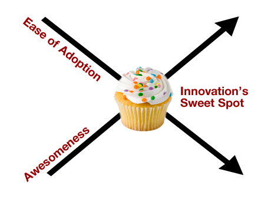

I must say that this is an entertaining book on history, innovation, invention, business, and perhaps a bit of philosophy. [The Myths of Innovation by Scott Berkun](http://www.amazon.com/gp/product/1449389627?ie=UTF8&tag=melodinmarke-20&linkCode=as2&camp=1789&creative=390957&creativeASIN=1449389627) is a delightful page turner above all else though due to its wit, humor, and flowing pace. Entertainment though is not the purpose, as Scott makes some strong points in the epilogue on the paramount importance of humility, interpersonal communication, experimentation, action, and practice. At about 190 pages with relatively short chapters, I do recommend it for folks to read for themselves (2010 paperback version).

**Note:** Though I had this book on my wishlist, O&#8217;Reilly publishing had offered me a review copy. What follows is an outline of the book&#8217;s chapters along with thoughts of my own for future reference. While I hope you find it useful, the book&#8217;s multiple historical examples and richer context will be of greater benefit than my outline alone.

## The Epiphany Myth

Flashes of brilliant insight are for storytelling and marketing. If they do happen in the real world, it&#8217;s the result of very long periods of hard work and reflection. Importantly, big ideas represent nothing inherently new, but rather a construct of pre-existing technologies or available knowledge. Scott says,

> *&#8220;Any major innovation or insight can be seen in this way. It&#8217;s simply the final piece of a complex puzzle falling into place. But unlike a puzzle, the universe of ideas can be combined in an infinite number of ways, so part of the challenge of innovation is coming up with the problem to solve, not just its solution. The pieces used to innovate one day can be reused and reapplied to innovate again, only to solve a different problem&#8230;What matters is the ability to see a problem clearly, combined with the talent to solve it.&#8221;*

## So You Think You Understand History

The history of various big innovations and discoveries of all sorts are also vastly simplified for easier storytelling by academics and marketers. Various parties and cultures, sometimes centuries apart, contributed to the notion of a printing press, aqueduct, firearms, automobiles, and television.

Scott asks the question if some historical innovations were inevitable. From a theoretical standpoint, we might say yes. But bad happenstance like asteroids wiping out the dinosaurs, the Dark Ages&#8217; effect on Western Europe, China&#8217;s political decision to cut off all international trade and dismantle its navy in the 14th century&#8230;just changes things around.

> *&#8220;Gasoline engines and automobiles&#8230;succeeded, in natural selection fashion, due to the combined circumstances of that time. Traffic jams, pollution, road rage, and dependence on limited oil supplies all call into question the suitability of the innovation we still base our lives on.&#8221;*

Let&#8217;s just call history multivariate, interdependent, chaotic, and for the large part unpredictable. How exciting life is!

## Innovation&#8217;s Got An Operating Manual

There is no magic playbook and no methodology will guarantee success. Just effort, time-invested, and willingness to learn are the basics. Kind of like dating I suppose 🙂 Surely there are some useful frameworks and guidelines to consider, no? You betcha, and they&#8217;re not as subjective as one might think. In terms of conditions that get the innovation ball rolling: working on a concentrated area, steering a new direction or application should an opportunity arise, having curiosity, wealth motivations, and needing a solution for a specific purpose.

As far as challenges go, Scott identifies: finding an idea, design & development, funding, production engineering for replication, marketing, beating the competition, timing, and paying the bills.

Healthy attitudes are also important, including: Gaining self-knowledge, which I&#8217;ll let Scott explain as,

> *&#8220;Every tough decision is made in part by how the innovator feels about herself: none of us is as logical as we like to believe. Being aware of the environments or challenges that inspire the best results for your personality helps you make smart path choices. The best business opportunity might be the least interesting personal challenge, and vice versa. Knowing yourself, and your team, is a big advantage and should guide decisions. It&#8217;s one of the few uncertainties that, given time, can always be converted into certain knowledge and used as an asset.&#8221;*

Other ones include rewarding interesting failures, periodically stepping back and reflecting on big picture questions and assumptions, focusing energy on becoming progressively better in a single field, and acknowledging luck and others&#8217; historical achievements as contributing factors to one&#8217;s progress or success.

## Everyone Loves New Ideas

Ha! I think it&#8217;s not so much that they don&#8217;t like new ones, but rather that everyone like&#8217;s their own. Hence the [Inception](http://www.imdb.com/title/tt1375666/) concept&#8217;s premise that if you&#8217;d like to make someone believe in something, give them all the supporting facts or thoughts without the actual declaration, so they&#8217;ll make it their own. But that&#8217;s not part of this book&#8230;so, moving on&#8230;as Scott says,

> *&#8220;&#8230;we prefer ideas only after others have tested them. We confuse truly new ideas with good ideas that have already been proven, which just happen to be new to us&#8230;Innovation is expensive: no one wants to pay the price for ideas that turn out to be not quite ready for prime time.&#8221;*

Which, in addition to risk aversion (financial, safety, regard), is why pursuing a fast follower strategy is sometimes best.

So innovators (and regular everyday people too!) often hear similar criticisms, including (**as quoted**),

  * This will never work
  * No one will want this
  * It can&#8217;t work in practice
  * People won&#8217;t understand it
  * This isn&#8217;t a problem
  * This is a problem, but no one cares
  * This is a problem and people care, but it&#8217;s already solved
  * This is a problem, and people care, but it will never make money
  * This is a solution in search of a problem

The fact is that *&#8220;until the innovation is accepted, it will be questioned relentlessly.&#8221;* Furthermore,

> *&#8220;Many innovators give up when they learn ideas &#8211; even with dazzling prototypes or plans in hand &#8211; are only the beginning. The challenges that follow demand skills of persuasion more than brilliance&#8230;*[and]* persuading demands mapping criticisms to deeper issues.&#8221;*

Some or maybe in your case, oftentimes the basis of criticism is based on emotional reasoning & reactions such as: ego/envy, pride and politics, having a personal issue (versus being objective), fear, other priorities at hand, laziness, security and fear of loss, greed, and conflict with personal values or principles. After all, we&#8217;re just human.

From an organizational and industry perspective, the reasoning for being averse to disruptive (as opposed to incremental) innovation has to do with an over-reliance on a specific set of customers who don&#8217;t need that particular solution, financial sense, plus an unwillingness to start an independent division for developing a technology and the market for it (as understood after reading [Clayton Christensen&#8217;s books](http://www.amazon.com/s?ie=UTF8&tag=mozilla-20&index=blended&link_code=qs&field-keywords=Clayton%20Christensen&sourceid=Mozilla-search)).

According to [Everett Rogers](http://en.wikipedia.org/wiki/Everett_Rogers), there are five factors that influence the speed at which innovations are adopted: relative advantage, switching costs (financial, psychological, behavioral), learning curve, availability for trial, and transparency of results. Scott adds,

> *&#8220;&#8230;since these factors vary from culture to culture, some innovations gain acceptance in surprising ways. There is no uniformity in progress around the world; innovations may be adopted by one culture or nation decades before another.&#8221;*

## Inventors Do It Alone

Having acknowledged the role that interdependence and pre-existing knowledge plays in the technological development, this myth seems pretty easy to beat. Let&#8217;s sprinkle in some additional truths. No one is superhuman (except maybe Richard Branson), and marketing loves heroic stories with lone protagonists who just know better, and whose pure brilliance shouldn&#8217;t be disturbed from outside influence. So while I can&#8217;t really summarize Scott&#8217;s chapter in other words than these, he includes lots of historical stories and examples in the book that make it (like the rest of the book) fun to read.

## Good Ideas are Buried Somewhere and We Don&#8217;t Have a Map

When we were young, the world was at our fingertips and the curse of knowledge and its clan of norms and constraints hadn&#8217;t infected us yet. With time and the sinking in of &#8220;that&#8217;s life, kid&#8221;, we bought into the established rules because it helped make easy sense of the world so we could easily adapt. Scott talks about the life and development of good ideas in this chapter. The first truth is that, you guessed it, ideas are nurtured over time and don&#8217;t come from a treasure chest found with state-of-the-art detection equipment. The second truth is that generating many ideas to be played with later, is better than trying to create a master-class of few. The obstacles to ideation are numerous, but some thinking patterns including the following are often primary culprits:

  * Already tried that OR never tried that **_[discounting the potential of previous or new ideas]_**
  * That&#8217;s now how we do that here **_[constraining ideas to organizational norms]_**
  * That never works **_[absolutistic thinking]_**
  * No resources available to do that (financial, human, time) **_[discounting the awesome force that working within constraints, and succeeding, can bring]_**
  * Not interesting to me or others **_[fear + discounting potential through emotional reasoning]_**
  * Not the direction/area we&#8217;re looking to innovate **_[applying screening filters too early in the process, thereby hindering idea generation]_**

So let&#8217;s just **Suspend Judgment**. That&#8217;s an easy enough rule, no?

Scott describes some excellent maxims from Alex Osborn&#8217;s book, &#8220;Applied Imagination&#8221;, well worth repeating here:

> *&#8220;You have three things: facts, ideas, and solutions&#8230;You need to spend time with each individually&#8221;*

Simple and powerful. In group ideation sessions though, you&#8217;ll need to have a facilitator to keep everyone focused on the objective, and keep the game going without fouls, stalling, or ball hogging. But brainstorming isn&#8217;t the only exercise. For more advice, see my posts [The Discovery Process,](../discovery-the-pursuit-of-breakthrough-ideas/) [Idea Screening](../idea-screening/), and [Think -> Concept -> Build](../think-concept-build/)

## Managers Know Better

And I thought managers were for projects and fostering exceptional employee performance! Well, that realistically should be their role. However, Scott puts it eloquently with the following,

> *&#8220;Those in power can make decisions others can&#8217;t, but that doesn&#8217;t mean they have the wisdom or experience to do it well, Every rock-star innovator has worked for someone who couldn&#8217;t innovate his way out of his pants. But we deny this because we often want to believe, despite evidence to the contrary, that those with authority are as talented as they are powerful. Faith in this idea makes working for them tolerable, as it offers an explanation (however false), for why we are working for them. There are exceptional managers out there, stars worthy of their power and more, but they&#8217;re hard to find. The of the time innovators must beware of their own myth-making: it&#8217;s easy to overlook people&#8217;s lack of talent by misplacing faith in their power&#8221;*

I think some managers deserve to be questioned for counsel, however unless the individual thinks as a facilitator AND the organizational culture supports innovative thinking, then the types of responses managers may provide could be discouraging. Another quote, this time from [Peter Drucker](http://en.wikipedia.org/wiki/Peter_Drucker), is also enlightening,

> *&#8220;Management tends to believe that anything that has lasted for a fair amount of time must be normal and go on forever. Anything that contracts what we have come to consider a law of nature is then rejected as unsound.&#8221;*

The reasoning behind all this? Scott points outs that this orientation is due to the persistent cultural influence of [I must say that this is an entertaining book on history, innovation, invention, business, and perhaps a bit of philosophy. [The Myths of Innovation by Scott Berkun](http://www.amazon.com/gp/product/1449389627?ie=UTF8&tag=melodinmarke-20&linkCode=as2&camp=1789&creative=390957&creativeASIN=1449389627) is a delightful page turner above all else though due to its wit, humor, and flowing pace. Entertainment though is not the purpose, as Scott makes some strong points in the epilogue on the paramount importance of humility, interpersonal communication, experimentation, action, and practice. At about 190 pages with relatively short chapters, I do recommend it for folks to read for themselves (2010 paperback version).

**Note:** Though I had this book on my wishlist, O&#8217;Reilly publishing had offered me a review copy. What follows is an outline of the book&#8217;s chapters along with thoughts of my own for future reference. While I hope you find it useful, the book&#8217;s multiple historical examples and richer context will be of greater benefit than my outline alone.

## The Epiphany Myth

Flashes of brilliant insight are for storytelling and marketing. If they do happen in the real world, it&#8217;s the result of very long periods of hard work and reflection. Importantly, big ideas represent nothing inherently new, but rather a construct of pre-existing technologies or available knowledge. Scott says,

> *&#8220;Any major innovation or insight can be seen in this way. It&#8217;s simply the final piece of a complex puzzle falling into place. But unlike a puzzle, the universe of ideas can be combined in an infinite number of ways, so part of the challenge of innovation is coming up with the problem to solve, not just its solution. The pieces used to innovate one day can be reused and reapplied to innovate again, only to solve a different problem&#8230;What matters is the ability to see a problem clearly, combined with the talent to solve it.&#8221;*

## So You Think You Understand History

The history of various big innovations and discoveries of all sorts are also vastly simplified for easier storytelling by academics and marketers. Various parties and cultures, sometimes centuries apart, contributed to the notion of a printing press, aqueduct, firearms, automobiles, and television.

Scott asks the question if some historical innovations were inevitable. From a theoretical standpoint, we might say yes. But bad happenstance like asteroids wiping out the dinosaurs, the Dark Ages&#8217; effect on Western Europe, China&#8217;s political decision to cut off all international trade and dismantle its navy in the 14th century&#8230;just changes things around.

> *&#8220;Gasoline engines and automobiles&#8230;succeeded, in natural selection fashion, due to the combined circumstances of that time. Traffic jams, pollution, road rage, and dependence on limited oil supplies all call into question the suitability of the innovation we still base our lives on.&#8221;*

Let&#8217;s just call history multivariate, interdependent, chaotic, and for the large part unpredictable. How exciting life is!

## Innovation&#8217;s Got An Operating Manual

There is no magic playbook and no methodology will guarantee success. Just effort, time-invested, and willingness to learn are the basics. Kind of like dating I suppose 🙂 Surely there are some useful frameworks and guidelines to consider, no? You betcha, and they&#8217;re not as subjective as one might think. In terms of conditions that get the innovation ball rolling: working on a concentrated area, steering a new direction or application should an opportunity arise, having curiosity, wealth motivations, and needing a solution for a specific purpose.

As far as challenges go, Scott identifies: finding an idea, design & development, funding, production engineering for replication, marketing, beating the competition, timing, and paying the bills.

Healthy attitudes are also important, including: Gaining self-knowledge, which I&#8217;ll let Scott explain as,

> *&#8220;Every tough decision is made in part by how the innovator feels about herself: none of us is as logical as we like to believe. Being aware of the environments or challenges that inspire the best results for your personality helps you make smart path choices. The best business opportunity might be the least interesting personal challenge, and vice versa. Knowing yourself, and your team, is a big advantage and should guide decisions. It&#8217;s one of the few uncertainties that, given time, can always be converted into certain knowledge and used as an asset.&#8221;*

Other ones include rewarding interesting failures, periodically stepping back and reflecting on big picture questions and assumptions, focusing energy on becoming progressively better in a single field, and acknowledging luck and others&#8217; historical achievements as contributing factors to one&#8217;s progress or success.

## Everyone Loves New Ideas

Ha! I think it&#8217;s not so much that they don&#8217;t like new ones, but rather that everyone like&#8217;s their own. Hence the [Inception](http://www.imdb.com/title/tt1375666/) concept&#8217;s premise that if you&#8217;d like to make someone believe in something, give them all the supporting facts or thoughts without the actual declaration, so they&#8217;ll make it their own. But that&#8217;s not part of this book&#8230;so, moving on&#8230;as Scott says,

> *&#8220;&#8230;we prefer ideas only after others have tested them. We confuse truly new ideas with good ideas that have already been proven, which just happen to be new to us&#8230;Innovation is expensive: no one wants to pay the price for ideas that turn out to be not quite ready for prime time.&#8221;*

Which, in addition to risk aversion (financial, safety, regard), is why pursuing a fast follower strategy is sometimes best.

So innovators (and regular everyday people too!) often hear similar criticisms, including (**as quoted**),

  * This will never work
  * No one will want this
  * It can&#8217;t work in practice
  * People won&#8217;t understand it
  * This isn&#8217;t a problem
  * This is a problem, but no one cares
  * This is a problem and people care, but it&#8217;s already solved
  * This is a problem, and people care, but it will never make money
  * This is a solution in search of a problem

The fact is that *&#8220;until the innovation is accepted, it will be questioned relentlessly.&#8221;* Furthermore,

> *&#8220;Many innovators give up when they learn ideas &#8211; even with dazzling prototypes or plans in hand &#8211; are only the beginning. The challenges that follow demand skills of persuasion more than brilliance&#8230;*[and]* persuading demands mapping criticisms to deeper issues.&#8221;*

Some or maybe in your case, oftentimes the basis of criticism is based on emotional reasoning & reactions such as: ego/envy, pride and politics, having a personal issue (versus being objective), fear, other priorities at hand, laziness, security and fear of loss, greed, and conflict with personal values or principles. After all, we&#8217;re just human.

From an organizational and industry perspective, the reasoning for being averse to disruptive (as opposed to incremental) innovation has to do with an over-reliance on a specific set of customers who don&#8217;t need that particular solution, financial sense, plus an unwillingness to start an independent division for developing a technology and the market for it (as understood after reading [Clayton Christensen&#8217;s books](http://www.amazon.com/s?ie=UTF8&tag=mozilla-20&index=blended&link_code=qs&field-keywords=Clayton%20Christensen&sourceid=Mozilla-search)).

According to [Everett Rogers](http://en.wikipedia.org/wiki/Everett_Rogers), there are five factors that influence the speed at which innovations are adopted: relative advantage, switching costs (financial, psychological, behavioral), learning curve, availability for trial, and transparency of results. Scott adds,

> *&#8220;&#8230;since these factors vary from culture to culture, some innovations gain acceptance in surprising ways. There is no uniformity in progress around the world; innovations may be adopted by one culture or nation decades before another.&#8221;*

## Inventors Do It Alone

Having acknowledged the role that interdependence and pre-existing knowledge plays in the technological development, this myth seems pretty easy to beat. Let&#8217;s sprinkle in some additional truths. No one is superhuman (except maybe Richard Branson), and marketing loves heroic stories with lone protagonists who just know better, and whose pure brilliance shouldn&#8217;t be disturbed from outside influence. So while I can&#8217;t really summarize Scott&#8217;s chapter in other words than these, he includes lots of historical stories and examples in the book that make it (like the rest of the book) fun to read.

## Good Ideas are Buried Somewhere and We Don&#8217;t Have a Map

When we were young, the world was at our fingertips and the curse of knowledge and its clan of norms and constraints hadn&#8217;t infected us yet. With time and the sinking in of &#8220;that&#8217;s life, kid&#8221;, we bought into the established rules because it helped make easy sense of the world so we could easily adapt. Scott talks about the life and development of good ideas in this chapter. The first truth is that, you guessed it, ideas are nurtured over time and don&#8217;t come from a treasure chest found with state-of-the-art detection equipment. The second truth is that generating many ideas to be played with later, is better than trying to create a master-class of few. The obstacles to ideation are numerous, but some thinking patterns including the following are often primary culprits:

  * Already tried that OR never tried that **_[discounting the potential of previous or new ideas]_**
  * That&#8217;s now how we do that here **_[constraining ideas to organizational norms]_**
  * That never works **_[absolutistic thinking]_**
  * No resources available to do that (financial, human, time) **_[discounting the awesome force that working within constraints, and succeeding, can bring]_**
  * Not interesting to me or others **_[fear + discounting potential through emotional reasoning]_**
  * Not the direction/area we&#8217;re looking to innovate **_[applying screening filters too early in the process, thereby hindering idea generation]_**

So let&#8217;s just **Suspend Judgment**. That&#8217;s an easy enough rule, no?

Scott describes some excellent maxims from Alex Osborn&#8217;s book, &#8220;Applied Imagination&#8221;, well worth repeating here:

> *&#8220;You have three things: facts, ideas, and solutions&#8230;You need to spend time with each individually&#8221;*

Simple and powerful. In group ideation sessions though, you&#8217;ll need to have a facilitator to keep everyone focused on the objective, and keep the game going without fouls, stalling, or ball hogging. But brainstorming isn&#8217;t the only exercise. For more advice, see my posts [The Discovery Process,](../discovery-the-pursuit-of-breakthrough-ideas/) [Idea Screening](../idea-screening/), and [Think -> Concept -> Build](../think-concept-build/)

## Managers Know Better

And I thought managers were for projects and fostering exceptional employee performance! Well, that realistically should be their role. However, Scott puts it eloquently with the following,

> *&#8220;Those in power can make decisions others can&#8217;t, but that doesn&#8217;t mean they have the wisdom or experience to do it well, Every rock-star innovator has worked for someone who couldn&#8217;t innovate his way out of his pants. But we deny this because we often want to believe, despite evidence to the contrary, that those with authority are as talented as they are powerful. Faith in this idea makes working for them tolerable, as it offers an explanation (however false), for why we are working for them. There are exceptional managers out there, stars worthy of their power and more, but they&#8217;re hard to find. The of the time innovators must beware of their own myth-making: it&#8217;s easy to overlook people&#8217;s lack of talent by misplacing faith in their power&#8221;*

I think some managers deserve to be questioned for counsel, however unless the individual thinks as a facilitator AND the organizational culture supports innovative thinking, then the types of responses managers may provide could be discouraging. Another quote, this time from [Peter Drucker](http://en.wikipedia.org/wiki/Peter_Drucker), is also enlightening,

> *&#8220;Management tends to believe that anything that has lasted for a fair amount of time must be normal and go on forever. Anything that contracts what we have come to consider a law of nature is then rejected as unsound.&#8221;*

The reasoning behind all this? Scott points outs that this orientation is due to the persistent cultural influence of](http://en.wikipedia.org/wiki/Scientific_management) and the idea that (in my words) _&#8220;I&#8217;m the manager, you&#8217;re the minion, and I know better because I&#8217;m an efficiency and production systems expert, while you&#8217;re the cog and gear worker bee that I can replace at a whim.&#8221;_

While there are definitely people who are happy to just exist as worker bees, it&#8217;s my opinion that innovation and quality improvement lives within the collective, and that organizational cultures which acknowledge this will perform better in the long run with less reliance on cash cows within their product portfolio as time goes on (a serious weakness in technology and product/service life cycles).

Scott goes on to bring up 5 challenges facing applied innovation:

  1. __Idea Management__ &#8211; How is the generation, screening, storage, recycling, and development process handled? Ideally, someone should be in charge of this in a systematic way.
  2. __Environment__ &#8211; How to develop and nurture an organizational culture?
  3. __Protection__ &#8211; Politics, available resources, and attitudes can kill innovative ideas or they might not just quite ready for prime time acceptance and development. Good ideas need protection and a good upbringing indeed.
  4. __Execution__ &#8211; Let me just say &#8220;project management&#8221;. Doesn&#8217;t matter whether it&#8217;s an Agile, Waterfall, or Pass the Ball approach.
  5. __Persuasion__ &#8211; Great communication and relentlessness required.

## Only the Best Ideas Win

That&#8217;s right! Remember the Betamax? The [Iridium](http://www.iridium.com/) global phone? Sometimes they might eventually win, as the case of [Tesla&#8217;s alternating current versus Edison&#8217;s direct current](http://en.wikipedia.org/wiki/War_of_Currents) had shown. There&#8217;s plenty of more examples like the metric system, but we probably all know that the maxim &#8220;Build it and they will come&#8221;, is a bunch of hogwash. One thing working against this myth is [the Change Function](../the-change-function/) (seriously, you have to read that article, a summary of Pip Coburn&#8217;s book). Another couple factors working against it include marketing and political forces. So why does the myth prevail? Because inventors are damn hopeful that their superior designs should win. To further drill home the fallacy, Scott gives 7 secondary factors of affecting an innovation&#8217;s adoption:

  1. __Culture__ &#8211; Does the technology fit within the society&#8217;s norms, virtues, or values?
  2. __Prevalent Design__ &#8211; Are there existing technological platforms, or human factors relating to current usage and behavior which would require significant financial and re-training costs?
  3. __Inheritance & Tradition__ &#8211; A little hard to explain, but it relates to the previous two. If advantage of switching is only marginal, tough luck.
  4. __Politics__ &#8211; Why is the science behind climate change contentious? Because oil and coal companies are protecting their interests. Did car companies fund many political candidates&#8217; elections in the Western U.S. in the 20th century, so as to encourage freeway construction and less funding for public transportation networks? You bet! It doesn&#8217;t matter if we&#8217;re speaking of government officials or not. If some party (or interconnected network) has business to lose, they&#8217;ll fight to sustain their future market share and growth, regardless of relative technological superiority, social or environmental long-term impact.
  5. **Economics** &#8211; Adoption, replacement, installation, disposal, life cycle, and related systemic costs all play a factor.
  6. __Advantages are Relative__ &#8211; Some features of a technology are more important to some than others. If we factor it into a market potential analysis, the innovation&#8217;s superiority in some areas may only be valuable enough for a niche market.
  7. __Short v. Long-Term Orientation__ &#8211; Short-term benefits first and long-term costs later? Or vice versa? Let&#8217;s throw in _&#8220;to whom&#8221;_ factors as well: personal, social, and environmental. Now add geographic scope too: local, state, national, world. Taking the most rewarding solution now regardless of long-term costs is easy, and may present a significant switching cost that innovations must overcome to survive.

Scott wraps up the chapter with some great historical examples, along with a diagram that sums it up nicely, which I&#8217;ve remixed into the following:

## The Relationship between Problems and Solutions

Scott said it best with the following,

> *&#8220;Discovering problems actually requires just as much creativity as discovering solutions. There are many ways to look at any problem&#8230;to paraphrase John Dewey, a properly defined problem is partially solved. And if your particular innovation involves the support of other people, a clearly defined problem helps form bonds and build teams where none existed before.&#8221;*

I like to think that if a solution is made for a non-existent problem, the result is likely to be novel, and doesn&#8217;t have market potential. Oftentimes solutions exist for a variety of general problems, but when we start adding conditions like geography, time, supporting technologies and platforms, specific applications, and types of beneficiaries to the problem, we can start framing it in a multitude of ways. Additionally, we can consider the technical, market, financial, political, and cultural limitations of previous attempts at solving the problem. Perhaps all the birds can fall better in place now, IF the problem is appropriately framed, constraints established, and tries to overcome them.

Financial and time considerations though deserve a little more attention though. It&#8217;s not just about projected costs. Unless one&#8217;s rich and has lots of time and passion to devote toward a project, loans need to be repaid, and a specific return on investment should be made by a certain time. Secondly, an innovation&#8217;s development and distribution timing is pretty important, since being too early or too late to market (or to **use** if we&#8217;re looking at process innovation), can entail less than ideal cash flows and competitive reactions.

## Innovation is Always Good

Surely must be, if an innovation&#8217;s performance exceeds that of existing solutions. But what is &#8220;positive&#8221;?. That label is open to interpretation from an ethics perspective, which audiences have something to gain or lose, and from a long term social and environmental impact assessment. Directly and indirectly. Since we&#8217;ve already discussed the systemic effects of all occurred phenomena, I&#8217;ll mention two great historical examples Scott brought up: pesticides (like DDT) causing damage to other wildlife, and unhealthy fast food contributing to rising obesity and heart disease over decades of cultural penetration.

Need we say more? Let&#8217;s just say it&#8217;s important to study and consider an innovation&#8217;s positive/negative impact on oneself, others, industry, society, and world. Doing so will also determine potential ethics, liability, competitive actions, and [business case](../building-the-business-case-plan/) implications. It&#8217;ll also help create an improved marketing plan too!

## Epilogue and Closing Statements

This is where Scott becomes more personal and his writing really shines. For best justice, you can read the [transcript of an excellent speech he gave to an Economist magazine seminar](http://www.scottberkun.com/blog/2010/my-speech-at-the-economist/), or watch the video below (also available at that link)
