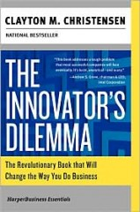

This has to be one of the [most influential business books of my life](http://www.amazon.com/gp/product/0060521996?ie=UTF8&tag=melodinmarke-20&linkCode=as2&camp=1789&creative=390957&creativeASIN=0060521996) (so far). Having been fascinated by design and technology since youth, there&#8217;s always appeared to be a randomness at work in what becomes successful. Yet in hindsight, everything always seems so obvious. There are patterns though. And Clayton spelled them out in the last half of the 1990s exceptionally well. As my good acquaintance Peter succinctly wrote (or did he quote?),

> *&#8220;&#8230;as established companies innovate with sustaining technologies to move toward higher margins and higher performance in larger, mainstream markets whose needs they eventually overshoot, they become so resource dependent on their customers and investors and so locked in their values and processes, that they are unable to develop technologies catering to emerging, lower-margin markets which don’t solve their growth needs. New companies with disruptive technologies then enter and exploit the vacuum in the lower end markets, and subsequently move toward mainstream markets as their technology develops and becomes widely adopted, disrupting the established companies’ markets. What makes successful companies succeed in their mainstream markets is precisely what makes them fail in the face of disruptive technological change  – complexity kills the cat.&#8221;*

A more thorough examination of [disruptive innovation can be found on the Wikipedia article](http://en.wikipedia.org/wiki/Disruptive_technology), which I highly recommend as it gives plenty of examples as well for people to think about. Fact is, change happens over a long period of time. Some businesses will get stuck, others will be positioned for growth. It&#8217;s the transition that matters.

Clayton advocates for creating subsidiaries to serve new customers and market segments made possible through disruptive technology so that they&#8217;ll receive the focus they deserve. Meddling and budget constraints from a higher department, versus a parent company, is harder on the success of the &#8220;startup&#8221;.
