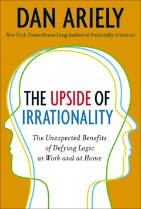

Another great book I&#8217;ve listened to on a road trip from Los Angeles to Phoenix was Dan Ariely&#8217;s &#8220;[The Upside of Irrationality](http://www.amazon.com/gp/product/0061995037?ie=UTF8&tag=melodinmarke-20&linkCode=as2&camp=1789&creative=390957&creativeASIN=0061995037)&#8220;. Dealing with behavioral economics, Dan talks about a variety of subjects which I summarized from the individual book chapters, along with direct quotations. As usual, this summary can&#8217;t give you the stories and context behind the notes provided below, so I do recommend reading the book if you&#8217;d like to learn more 🙂

### How Paying People a Lot More, Results in Less

Giving people high rewards/bonuses in games or for jobs can result in high performance for simple mechanical tasks, but the opposite can happen when asking people to use their brains. This is what companies try to do in paying executives high bonuses for work that requires a lot of creative/analytical brainpower and action. Game studies with cognitive challenges have shown that as the reward exponentially increases, actual performance suffers in comparison to other players with lower rewards. Increased desire for reward can create anxiety and the resulting thoughts become distracting and stressful, thus hindering the performance.

Does this necessarily mean high rewards are intrinsically bad? No. But there are some effects of the reward system worth noting. First off, is that bonuses are meant for actual great performance that can be concretely measured. They shouldn&#8217;t necessarily be expected either. If people expect an automatic reward at known periodic intervals because it&#8217;s part of the culture or traditions, then there&#8217;s no incentive for people to seek higher achievements, especially if performance measurement is subjective and opaque. What can end up happening as a result is that many people will start to buy things with debt, expecting to offset that with the expected future revenue. These types of systemic conditions and effects are in my opinion, an absolute perversion and travesty of personnel management.

What&#8217;s the solution then? Well, for one be extremely wary of massive financial rewards in lump sums. The possibility is that people will underperform either due to stress (where performance can be concretely assessed), or because they know they can simply get away with it by fudging some numbers or communicating well.

Secondly, consider rewarding people smaller amounts based on performance in more, shorter time intervals. This can work great in many scenarios, although it can present ethical challenges in certain functions where cutting corners in quality and ethics (production, sales, service, other) may present a long-term loophole for people to advance their rewards.

Lastly, consider how randomly given rewards (financial, non-financial, and social recognition) can affect people&#8217;s behavior. It&#8217;s natural and not-expected! A friend of mine used such a system with a group of employees where he built financial bonuses into their annual salary for accounting purposes (as opposed to maintaining a separate account), but didn&#8217;t let them know about it. Based on their actual performance at any given time, he&#8217;d variably reward people with that extra line item on their paystub. Awesome! I can imagine such a system could be difficult to design and manage, but at least it did help he claimed with improved morale, accomplishments, and lower absenteeism.

### The Meaning of Labor

Breaking tasks into smaller parts and creating local efficiencies reduces errors, increases productivity, and allows scale production.

*&#8220;&#8230;each person can become better and better at the small thing he does. (Henry Ford and Frederick Winslow Taylor extended the division-of-labor concept to the assembly line&#8230;*[however] *the division of labor can also exact a human cost. As early as 1844, Karl Marx&#8230;pointed to the importance of what he called &#8220;the alienation of labor.&#8221; For Marx, an alienated laborer is separated from his own activities, from the goals of his labor, and from the process of production. This makes work an external activity that does not allow the laborer to find identity or meaning in his work.&#8221;*

Employee happiness and motivation beyond monetary compensation alone are increased and sustained by seeing one&#8217;s contribution to the whole. A feeling of meaning, purpose, sense of completion.

Dan tells the story of one young gentleman that went to a great school, was hired by a large reputable management consultancy, paid handsomely, but was miserable as a glorified researcher and Powerpoint presentation designer whose job consisted of analysis and reporting assignments for consideration by higher management that needed insights on a variety of projects. These projects however stood naked. There was no transparency about why it was being considered, who it was for, the impact on the client or the consultancy, if the project would even be reviewed later, or if there was to be specific action taken on the project if it were to be reviewed.

Related, is the concept of distributed information logging and micro-tasking within software platforms like ERP (enterprise resource planning). While a hive participation in such information systems do significantly help management and individuals make better decisions, there is a real need for feedback into how one&#8217;s participation is helping other individuals and the larger organizational goal. People may understand and assume their contributions&#8217; benefits, but feedback is really helpful. This could be delivered by managers who run reports and personally acknowledge people, as is an important part of being a manager over people. Alternatively, such feedback could be provided automatically by the information systems themselves, preferably with a little bit of anthropomorphic messaging and graphics for a more humanistic delivery.

**Lesson:** Although some work may not be glamorous, don&#8217;t mess with the process of labor, human psychology, and the personal need for feeling that one is doing meaningful work that is part of a larger goal.

### We Overvalue What We Create

The more effort you exert into making something, the more valuable it is to you, regardless of its fair market monetary value. Small individual contributions to the process make it more meaningful. Ex: IKEA furniture, pottery, crafts, cakes, and origami.

As a result of experiments, Dan describes 4 principles of human endeavor (as quoted):

  1. The effort that we put into something does not just change the object. It changes us and the way we evaluate that object.
  2. Greater labor leads to greater love.
  3. Our overvaluation of the things we make runs so deep that we assume that others share our biased perspective.
  4. When we cannot complete something into which we have put great effort, we don&#8217;t feel so attached to it.

### We&#8217;ll Believe it If We Own It &#8211; Not Invented Here Bias

Same as previous principle but applied to ideas. If we can&#8217;t paint scenarios or provide people the clues and means to figure out something (perhaps to an intended outcome, feeling, or belief), then they&#8217;re not going to be as willing to trust the ideas you&#8217;re putting forward. A sense of ownership (individual or collective) will bring people on board much better than trying to convince them through facts and objective reason.

ME: Rhetorical questions are a powerful means of stimulating creative thinking and idea ownership.

### The Case for Revenge

In interactive exchange scenarios with much transparency, people tend to play by the rules and expect others to do so as well. This is the common outcome of the [Ultimatum Game](http://en.wikipedia.org/wiki/Ultimatum_game). But go against the rules of perceived fair exchange, and the case for revenge is quickly established. Revenge is the flipside of Trust; a reaction to a sense of betrayal. I think enough&#8217;s said.

### Adaptation to Pain and Change

We adapt to Pain (physical, mental, emotional, financial), somehow or another. Change as &#8220;pain&#8221; is also clear from an Eastern perspective, as a result of attachment & disruption of happy scenarios, temporary/long-term.

**Hedonic Adaptation:** The process of getting used to events and change. Influencing factors: predictability and our expectations.

One of my favorite phrases is the concept of the _Hedonic Treadmill_:

*&#8220;By failing to anticipate the extent of our hedonic adaptation, as consumers we routinely escalate our purchases, hoping that new stuff will make us happier. Indeed, a new car feels wonderful, but sadly, the feeling lasts for only a few months. We get used to driving the car, and the buzz wears off. So we look for something else to make us happy: maybe new sunglasses, a computer, or another new car. This cycle&#8230;is what drives us to keep up with the Joneses&#8230;We look forward to the things that will make us happy, but we don&#8217;t realize how short-lived this happiness will be, and when adaptation hits we look for the next new thing. &#8220;This time,&#8221; we tell ourselves, &#8216;this thing will really make me happy for a long time.'&#8221;*

In making predictions on hedonic adaptation to change, we usually forget to consider how life goes on, and that both positive and negative events will influence our future self state-assessment. Regardless of our degree of emotional attachment and groundedness in realism, there is a process to minimizing pain 🙂

__Lesson__**:** Better to get big pain over with fast, and low intermittent pain slow.

### Experiences are More Powerful than Physical Objects

Indeed they are! This is also a premise of people who say they&#8217;ve had exciting and fun lives throughout history. In recent times in response to excess consumerism and the high long-term cost of debt, many folks are advocating further development of the experience economy. Lisa Gansky in her book &#8220;[The Mesh](http://www.amazon.com/gp/product/1591843715?ie=UTF8&tag=melodinmarke-20&linkCode=as2&camp=1789&creative=390957&creativeASIN=1591843715)&#8220;, which I&#8217;ve [summarized in this blog post along with her video presentation](../future-sharing-renting-physical-assets-technology-lisa-gansky/), describes enabling access to experiences as opposed to ownership of assets, which may carry high costs and extra burdens for disposal (not to mention environmental impact for something that&#8217;s seldom utilized anyway, loses value, then gets thrown away).

But obviously, emotional reactions to experiences (positive/negative) will be fleeting too. Dan gives us the following lessons:

__Pleasurable experiences__ &#8211; Insert interruptions to maximize enjoyment

__Irritating experiences__ &#8211; Complete immediately to minimize pain

### Assortative Mating and Beauty

This was a funny chapter on dating websites and tests. Obviously, there&#8217;s some basic screening criteria which people would like to use to determine who they&#8217;d like to potentially long-term date including age, sex, sexual preference, marital status, geography, income, race, religion, ethnic background, drug use (alcohol, tobacco, illicit), and perhaps eating and exercise habits.

There are practically two classes of dating sites based on the amount of data is required by users to provide, the ranking of attributes behind the scenes, and the capabilities of users.

From sites that used analytics to match people based on a large variety of criteria, people ended up spending much, much more time filling out profiles and searching during the week than actually going out with someone new. Sometimes these sites didn&#8217;t offer users the ability to simply browse and contact other individuals on their own. eHarmony is the most prominent of this type of dating site. However, it should be noted that that site is intended for meeting lifelong partners, not for casual dating. Yet, I believe that this type of user experience is extremely frustrating to people who just want to go hang out with someone new, let conversation take its course, and go from there.

And that&#8217;s what experiments Dan had noted in the book showed. Users of that type of site tended to be less happy and feel lonelier in such a strict dating system. People were also tested using another site that required much less user data upfront, assumed people were more open about who&#8217;d they might actually enjoy (not necessarily perceive) going out with, then gave them matches based on a more subjective ranking methodology.

The result was that people using the second site went out on more dates, with a less serious potential matchmaking mindset, spent considerably fewer hours per week on the website, and claimed higher satisfaction levels.

**Lesson:** Accuracy isn&#8217;t everything, and too many data factors and how they&#8217;re ranked may adversely affect conducting analyses and generating results/matches. Overestimating the importance of additional small factors, can diminish our factoring of the few, most important ones in making an appraisal.

### Empathy and Emotions

Outside the context of therapy, the extent to which we can feel empathy is correlated to our relatedness to the object, how concretely it&#8217;s understood, and its personability. Makes sense.

In philanthropy and advocacy, an emotional connection is VERY important. Use photos, videos, and stories as much as possible. Use some facts, but don&#8217;t rely on them excessively. Reframe systemic/big problems into an opportunity to benefit a small sample/lot size.

Future suffering is intangible and a hard sell. Don&#8217;t rely on it. Know that impersonal problems don&#8217;t relate to people. For that reason, paint pictures of real life people in your marketing communications.

*&#8220;In many ways, it is very sad that the only effective way to get people to respond to suffering is through an emotional appeal, rather than through an objective reading of massive need. The upside is that when our emotions are awakened, we can be tremendously caring. Once we attach an individual face to suffering, we&#8217;re much more willing to help, and we go far beyond what economists would expect from rational, selfish, maximizing agents. Given this mixed blessing, we should realize that we are simply not designed to care about events that are large in magnitude, take place far away, or involve many people we don&#8217;t know. By understanding that our emotions are fickle and how our compassion biases work, perhaps we can start making more reasonable decisions and help not only those who are trapped in a well.&#8221;*

The last lesson of the book Dan gives is this: Don&#8217;t act on negative emotions, for we may regret the consequences later.
