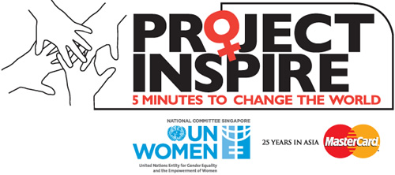

This [cause campaign from United Nations Women and MasterCard](http://5minutestochangetheworld.org/) is a contest for $25k where entrants submit a 5-minute video or 2-page pitch to help empower disadvantaged women or girls.

What I love about the website is its limited content of 4 pages explaining the program, and clear communication design for the instructions. Want people to participate? Create an environment and use language that facilitates understanding, emotional appeal, and promotes action. Basta!
