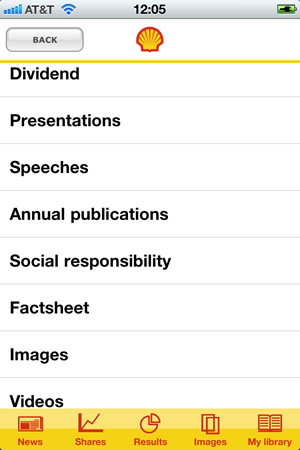

Stakeholder engagement is important. In the corporate realm, investors and analysts are kept best in the know regarding financial data, but very likely don&#8217;t know anything about social responsibility. The inclusion of ESG data on Bloomberg terminals is great progress, but some folks think integrated reporting is the only way to get this info in front of investors. Well, having heard about the Shell Oil mobile application for investors, I thought of trying it out to see how objective company communications could be made even more concise and relevant when the smaller screen estate demands greater focus on just the essentials (and the fluffy marketing speak can be left out).

Here&#8217;s the opening screens:

Hitting on the &#8220;Full Menu&#8221; button brings us the listing screen on the left. Scroll down a bit and low and behold, is a section on Social Responsibility. Yay!

As you can see in the right screen above, this section is also available as a permanent menu item (out of 6 choices) in &#8220;My Library&#8221;. You can finger scroll left to right, through 5 various reports Shell provides, and download the PDF to your phone.

via [IR Web Report](http://irwebreport.com/20110331/shell-ipad-android-apps-investors-media/)
