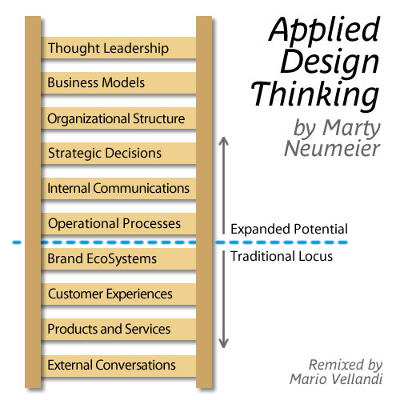

Marty Neumeier is a recognized thought leader in brand strategy, innovation, and design whose insight helps transform businesses from the inside out. His mission is to &#8220;incite business revolution by unleashing the power of design thinking.&#8221;

Some great points he brings up is the importance of having a vision. Going beyond mere analysis of reality and what has been. Secondly, he describes how design/innovation thinking has an expanded continuum of applications, as I&#8217;ve illustrated below:

Lastly, I liked how Marty described the brand advantage of being &#8220;good and different&#8221; in comparison to other 3 potential brand position quadrants. Standing out from the crowd while providing an excellent functional experience may take some time for people to get used to. Adoption and sales will be slow at first, but theoretically should pick up momentum as marketplace differentiation and a unique brand personality begin to be liked.

[Video Link for Email/Other Subscribers &#8211; 13min](http://www.youtube.com/watch?feature=player_embedded&v=z8VMVthL8vw)
