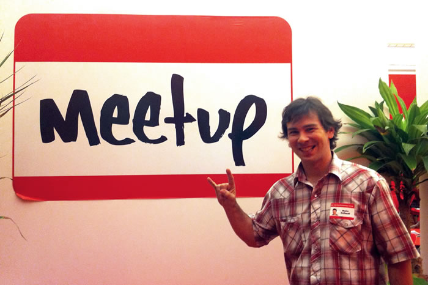

Recently, I attended an event at [Meetup.com](http://Meetup.com) headquarters in Manhattan. They have a separate office just to host small groups that they support, including beer and soda 🙂 While there, I noticed a sheet outlining the qualities of a potential team member or manager. This type of cultural info is often interesting to see, and thought I&#8217;d share.

But first the obligatory photo of me by the big sign!

And here&#8217;s the qualities&#8230;

