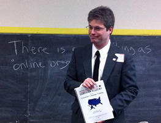

A couple months ago, I attended a short class on advocacy marketing and community management, led by Charles Lenchner of [Organizing 2.0](http://www.organizing20.org/).

One of his points was that there was no such thing as &#8220;_online organizing_&#8220;. Similar to what Justin Isaf had said [in an interview on communities](../community-management-digital-marketing-justin-isaf-people-engagement/), one can only communicate with and guide people to take action.

Charles discussed a brief history of nonprofit funding which started by first appealing to mothers, then to corporations and foundations, and finally to the general public and targeted individuals.

Longstanding nonprofits had worked with corporations and the government on employee contribution programs based on a fixed percentage of their income or nominal amounts. These proceeds would go to single beneficiary orgs or to a distributed fund like [United Way](http://liveunited.org/). While this model worked well for many years, one downside for nonprofits in an employee funded model was the increasingly shorter employment lengths of individuals with any one org. Hence the need for branding and mass outreach to people targeted through CRM systems, beginning with direct mail and telephone.

Over time, we&#8217;ve progressed from rudimentary and distributed marketing data collection and intelligence systems to eCRM systems that vastly improved taskflows, metrics, and pipeline management, to the modern day social CRM paradigm.

While all 3 approaches co-exist in a dynamic marketing system, the opportunity that eCRM offers with email marketing is still **VERY** powerful and robust with strong analytics and the greatest opportunity to trial ideas, measure performance, and refine tactics.

As an example, he shared how [MoveOn.org](http://front.moveon.org/) had tested various layouts, colors, and calls to action in their emails to constituents, measured results, and kept tweaking for maximum benefit. Great CRM is thus a strategic asset, in terms of the software, data, **AND** people who can use it.

Since email is the only guaranteed way to reach people (unless stuck in an automated spam filter), it only makes sense to try and get fans and interested parties within social media channels into one&#8217;s CRM. With a great offer or compelling reason, the right people should enter. The important thing though is **RELEVANCY** of those future communications with the folks who opted in. That comes down to profile data and segmented list types.

In many regards, this is a strong reason why [Salesforce](http://www.salesforce.com/) acquired [Radian6](http://www.radian6.com/). Develop greater knowledge about nonusers, critics, customers, influencers, and potential leads.

While it seems only logical then that the point of social network marketing is to somehow get users in your system, I&#8217;m afraid such an attitude unfortunately objectifies people online to targets to be marketed to. There&#8217;s a more humanistic approach though and it&#8217;s characterized by relevancy, transparency, and having a personable brand. Should social channels then be used primarily for awareness, engagement, and word of mouth? Probably.

If you&#8217;re interested in software reviews for nonprofits, Charles recommends checking out [Idealware.org](http://Idealware.org). Secondly, avoid absolutists around particular platforms. Conditions and needs will vary for every enterprise.

__The Master Toolbox__

  * CRM, listening, digital pr, ads, social media
  * Groupware and collaborative software (documents, conferencing, sharing)
  * Web analytics (site visits, ctr, time on site, referrers)
  * Site structuring for AIDA (awareness, interest, desire, action), creating conversion beacons
  * SEO
  * Video for cause awareness, progress feedback, online channels (features, distribution tools)
  * Content development and management
  * Email template design
  * Digital strategist &#8211; consultant&#8217;s consultant (knows lay of land)

**Interesting Aside:** Charles notes that [Charity Water](http://www.charitywater.org/) owes most of its success through existing social equity in friends & influencers at big companies, from the very beginning to today. Therefore, nonprofits shouldn&#8217;t hope for big growth potential just by using social media tools, a great website, and terrific video storytelling.

__Analyzing Tools and Approaches__

  * ROI v. ROO
  * Value comparison between options
  * Identify secondary costs like training, and opportunity costs
  * Consider marketing objectives, funds, and volunteers
