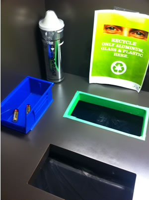
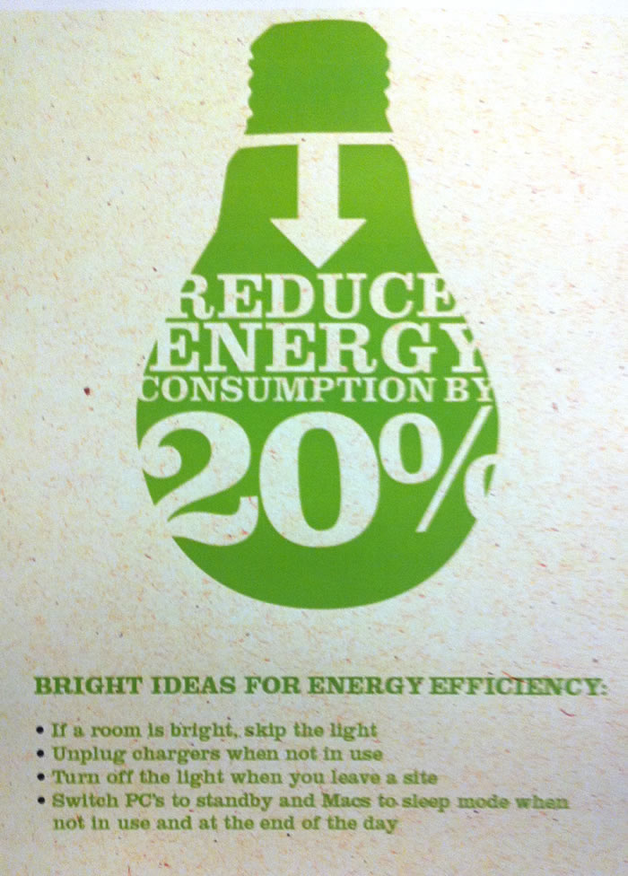
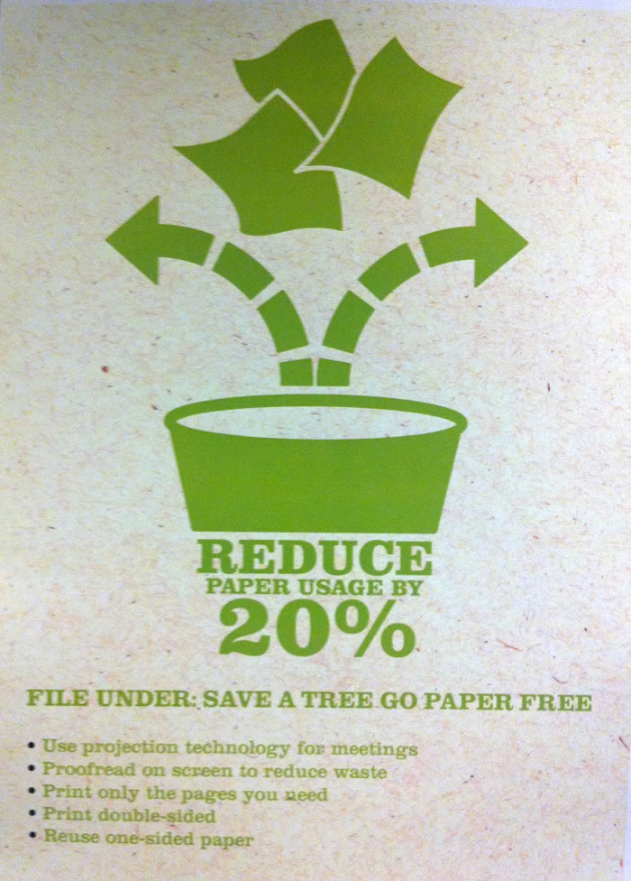

One of the companies I had interviewed with was LF USA, the subsidiary of a billion-dollar [Chinese conglomerate](http://www.lifunggroup.com/eng/global/home.php) that you&#8217;ve likely never heard of. While the position seemed interesting, involving the development of an employee social network as the company is planning to rapidly expand in the coming years, it was their highly visible commitment to sustainability that caught my eye.

Considering their specialty in the end-to-end design, sourcing, production, and distribution of various merchandise in 30+ countries, it&#8217;s relatively easy to understand how a commitment to eco-efficiency can be important to the bottom line. However, based on my impressions from the wording of the various posters and web copy I found online, there was an ethical imperative underlying it all.

With my smartphone at hand and the opportunity to grab some coffee in the break room, and see the restroom, I just had to snap the following photographs to share what I found to be a fantastic example of bringing the sustainability message to employees without being too subjective.

Only thing missing from these goals is a expected completion date for the quantified ones (#2 &#8211; 5).

